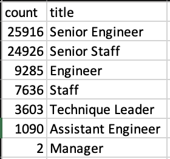
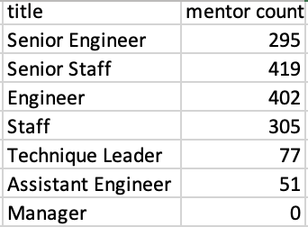
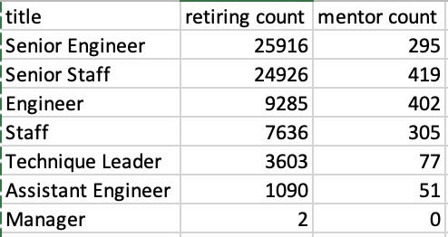

# Pewlett-Hackard-Analysis

## Overview of the analysis
Pewlett-Hackard has asked to determine the number of retiring employees per title and identify employees who are eligible to participate in a mentorship program. This has been accomplished by creating tables by utilizing the database that Pewlett-Hackard has provided access to and manipulating the the various tables in order to answer management's questions surrounding the "silver tsunami."

## Results

### Retiring Titles Table Review
- 72,458 employees will be retiring in the "silver tsunami."
- 70% of Senior Engineers (36%) and Senior Staff (34%) are role titles that are most impacted.
    

[Retiring Titles](./Data/retiring_titles.csv)

### Mentorship Eligibility Tabe Review
- 1,549 with birth dates in 1965 and retirement on the horizon are eligible for the mentorship program.
- Pewlett-Hackard will need to get creative with their mentorship strategy as the number of eligible employees is dwarfed by the by the "silver tsunami."

[Mentorship Eligibility (full file)](./Data/mentorship_eligibility.csv)

## Summary

How many roles will need to be filled as the "silver tsunami" begins to make an impact? 
    - 72,458 retirees post tsunami

Are there enough qualified, retirement-ready employees in the departments to mentor the next generation of Pewlett Hackard employees? 
    - As mentioned in the results, Pewlett-Hackard will be in a hightened recovery mode as the there will only be 1,549 eligible mentors with a birth date in 1965 to help guide the replacements for the 72,458 vacant roles after the "silver tsunami."

